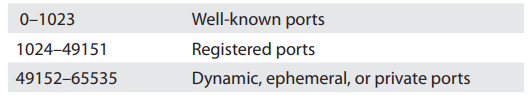

# Chapter-8 TCP/IP Applications

# Transport Layer and Network Layer Protocols

> There is no such thing as TCP/IP. TCP over IP is really many other things, such as HTTP, DHCP, POP, and about 500 more terms over TCP, plus UDP and ICMP over IP.
> 

## How People Communicate

> In networking, any single communication between a computer and another computer is called a session. When you open a web page or call your buddy using internet you create a session. All sessions must being and eventually end.
> 

### TCP

> Transmission Control Protocol (TCP) enables connection-oriented communication in networks that use the TCP/IP protocol suite. This protocol designed to check for errors.
> 
- **TCP three-way handshake**
    
    > When you enter a  computer’s address in the browser running on Client
    > 
    - It sends a single SYN (synchronize) segment to the Web server.
    - If Server gets that segment, it returns a single SYN, ACK (synchronize, acknowledge) segment.
    - Client then sends Server a single ACK (acknowledge) segment and immediately requests that Server begin sending the Web page.
    - Once Server finishes sending the Web page, it sends a FIN (final) segment.
    - Client responds with an ACK segment and then sends its own FIN segment.
    - The server then responds with an ACK; now both parties consider the session closed.
    - Note: If a sending computer doesn’t see an ACK for an outstanding segment, the sender takes the initiative to send it again.

### UDP

> User Datagram Protocol (UDP) is perfect for the types of sessions that don’t require the overhead of all that connection-oriented stuff. These include sessions that use important protocols such as DNS, DHCP, NTP/SNTP, and TFTP.
> 
- **DNS**
    
    > Domain Name System (DNS) translates domain names into IP addresses so that computers can understand and use them.
    > 
    - DNS uses UDP on port 53 by default.
- **DHCP**
    
    > Dynamic Host Configuration Protocol (DHCP) uses UDP. Sending a connectionless datagram also makes sense because the client won’t have an IP address to begin the three-way handshake. Plus, if the server doesn’t respond, the client can simply ask again.
    > 
    - DHCP uses two port numbers. DHCP Clients use port 68 and DHCP servers uses port 67 for sending and receiving data.
- **NTP/SNTP**
    
    > The Network Time Protocol (NTP) and his lightweight little brother, Simple Network Time Protocol (SNTP), use UDP to synchronize the clocks of devices on a network.
    > 
    - Computers need to use the same time so services like Kerberos authentication work properly.
    - NTP works in a hierarchy, starting with stratum 0 devices (e.g., atomic clocks, GPS) that keep perfect time. Stratum 1 servers sync to them, followed by stratum 2 and so on, down to stratum 15, beyond which synchronization is lost.
    - NTP/SNTP uses port 123.
- **TFTP**
    
    > Trivial File Transfer Protocol (TFTP) enables you to transfer files from one machine to another. TFTP, using UDP, doesn’t have any data protection, so you would never use TFTP between computers across the Internet.
    > 
    - TFTP uses port 69.
    - **TFTP Usage**
        - Updating software and configurations on routers, switches, VoIP phones, and other devices on a LAN, where the chances of losing packets is very small.

### ICMP

> Internet Control Message Protocol (ICMP) works at Layer 3 to handle low-level housekeeping tasks such as host unreachable messages and router advertisements.
> 
- **Ping**
    
    > The ping utility works by sending a single ICMP message called an `echo request` to an IP address you specify. All computers running TCP/IP respond to echo requests with an echo reply.
    > 
    - If your computer has `no route` to the address listed, ping displays `destination host unreachable.`
    - If you ping a device and no echo reply comes back before the default time, ping responds with `request timed out.`

### IGMP

> Internet Group Management Protocol (IGMP) enables routers to communicate with hosts and switches to determine a “group” membership. multicast traffic (called an IGMP group) is assigned to an address in the Class D range, and those who wish to receive this multicast must tell their upstream router or switch that they wish to receive it. To do so, they join the IGMP group.
> 

# The Power of Port Numbers

> Port numbers is critical to protect your network, make routers work better, and address a zillion other issues.
> 
- The Internet Assigned Numbers Authority (IANA) today recommends using only ports 49152–65535 as ephemeral ports.

## Registered Ports

> The port numbers from 1024 to 49151 are called registered ports. Unlike well-known ports, anyone can use these port numbers for their servers or for ephemeral numbers on clients. The full list pf ports:
> 



- Terms for the session information (IP address, port number, and Layer 4 protocol) held in memory on a single computer—socket or endpoint.
- Terms for the session information held in memory on two computers about the same connection—socket pairs or endpoints.
- Term for the whole interconnection—session

## Connection Status

> Connection Status is useful for determining what’s happening on networked computers.
> 
- ***LISTENING***
    
    > `listening port` is a socket that prepared to respond to any traffic destined for that socket’s port number or `open port`.
    > 
    > 
    > `TCP 0.0.0.0:445 0.0.0.0:0 LISTENING`
    > 
- ***ESTABLISHED***
    
    > `Established ports` are active, working endpoint pairs
    > 
    > 
    > If another computer on my network (192.168.4.83) was accessing the shared folders:
    > 
    > `TCP 192.168.4.27:445 192.168.4.83:1073 ESTABLISHED`
    > 
- ***CLOSE_WAIT***
    
    > Eventually, one side of the connection will initiate the close with a FIN signal and the other side will go into passive close
    > 
    > 
    > `TCP 192.168.4.27:57913 63.246.140.18:80 CLOSE_WAIT`
    > 
    
- ***netstat commands***
    
    ```powershell
    ## To see all your listening ports.
    netstat –an
    ## OUTPUT:
    ## Proto Local Address Foreign Address State
    ## TCP 0.0.0.0:7 0.0.0.0:0 LISTENING
    -----------------------------------------------------
    ## The –o switch tells netstat to show the process ID
    netstat –ano
    ## OUTPUT:
    ## Proto Local Address Foreign Address State PID
    ## TCP 192.168.4.27:1065 104.16.249.249:443 ESTABLISHED 9796
    -----------------------------------------------------
    ## To know the name of the running program
    netstat –anob
    ## OUTPUT:
    ## Proto Local Address Foreign Address State PID
    ## TCP 192.168.4.27:1065 104.16.249.249:443 ESTABLISHED 9796
    ## [firefox.exe]
    ```
    

# Common TCP/IP Applications

## Telnet and SSH

### Telnet

> Telnet enables people sit at their terminals and, instead of accessing only their local mainframes, access totally different mainframes. The protocol to do this was called the `Telnet Protocol` or simply `Telnet`.
> 
- Telnet servers run on `TCP` port `23`
- Telnet enables you to administer a server remotely and communicate with other servers on your network. (has a type of authentication too.)
- Telnet does not have any form of encryption.
- If someone intercepted the conversation between a Telnet client and Telnet server, he or she would see all the commands typed, password , …

### SSH

> Secure Shell (SSH), a protocol that works on the surface exactly like Telnet, but has security with encryption and authentication plus a few other tricks up its sleeve.
> 
- SSH uses `TCP` port `22`

## E-mail

> E-mail programs use Layer 7 (Application) protocols to send and retrieve information.
> 

### SMTP

> The Simple Mail Transfer Protocol (SMTP) is used to send e-mail from clients and between e-mail servers.
> 
- SMTP travels over `TCP` port `25` by default.

### POP3

> Post Office Protocol version 3 (POP3) is one of the two protocols that retrieve e-mail from e-mail servers. (POP3 is on its way out today)
> 
- POP3 uses `TCP` port `110`.

### IMAP4

> Internet Message Access Protocol version 4 (IMAP4) is a preferred alternative to POP3. Like POP3, IMAP4 retrieves e-mail from an e-mail server.
> 
- IMAP4 uses `TCP` port `143` and supports some features that are not supported in POP3.

### E-mail Servers

> E-mail servers accept incoming mail and sort out the mail for recipients into individual storage area mailboxes. These mailboxes are special separate folders or directories for each user’s e-mail.
> 
- Two mail server types dominate the once-fragmented e-mail server space: Exim and Postfix.

### E-mail Client

> An e-mail client is a program that runs on a computer and enables you to send, retrieve and organize e-mail.
> 
- ***Configuring an E-mail Client***
    
    
    

### Web Mail

> You can access your e-mail from anywhere. Like Google’s Gmail , Microsoft’s Outlook Mail, and Yahoo!’s Yahoo! Mail.
> 

## SQL

> Every major relational database (RDBMS), for example, uses the Structured Query Language (SQL).
> 
- Microsoft’s SQL Server uses port 1433.
- Oracle’s SQLnet uses port 1521.
- The open source MySQL uses port 3306.

## FTP

> File Transfer Protocol (FTP) was the original protocol used on the Internet for transferring files.
> 
- Active FTP uses `TCP` ports `21` and `20` by default, although passive FTP only uses port `21` by default.
- Although FTP is still used, you should avoid it. FTP is not very secure because data transfers are not encrypted by default. like Telnet, the usernames and passwords are sent over the network in cleartext.

### Active vs. Passive FTP

> When your client sends an FTP request, it goes out on port 21. When your FTP server responds, however, it sends the data back using an ephemeral destination port and port 20 as a source port.
> 
- ***Problem with NAT***
    
    > Active FTP works great unless your client uses NAT. Since your client didn’t initiate the source port 20, your NAT router has no idea where to send this incoming packet.
    > 
    - With passive FTP the client sends an FTP request on port 21 just like active FTP
    - Then the server sends back a random port number, telling the client which port it’s listening on for data requests.
    - The client, in turn, sends data to the port specified by the FTP server. (Because the client initiates all conversations, the NAT router knows where to send the packet.)

## HTTP and HTTPS

> The Web is composed of servers running Web server software, such as NGINX, Apache HTTP Server, or Microsoft Internet Information Services (IIS), that speak the Hypertext Transfer Protocol (HTTP)  and, traditionally, serve up HTML.
> 

### HTTP

> Hypertext Transfer Protocol (HTTP) is the underlying protocol used by Web servers.
> 
- HTTP runs traditionally, on `TCP` port `80`.

### SSL/TLS and HTTPS

> Because anyone easily could create a fake Web site to trick people into thinking it’s a legitimate Web site and then steal their usernames and passwords. For these and other reasons, the Internet has moved away from HTTP.
> 
- ***For an Internet application to be secure, it must have the following:***
    - **Authentication:** Usernames and passwords
    - **Encryption:** Stirring up the data so others can’t read it
    - **Nonrepudiation:** Source is not able to deny a sent message
- HTTPS uses Transport Layer Security (TLS) and uses `TCP` port `443`.

# TCP/IP Applications Chart


# Other Layer 7 Applications

## Zoom

> The Zoom client uses `UDP` and `HTTPS` over port `443` to connect to Zoom servers initially, then connects to the various multimedia aspects (video, voice, etc.) using Zoom’s proprietary protocol and `UDP` over port `8801`. If UDP fails, Zoom will connect using `TCP` over port `8801`.
> 

## Teams

> The initial connectivity relies on `UDP` and `HTTPS` over port `443`. Just like Zoom, though, Teams will use `TCP` if `UDP` doesn’t work.
>